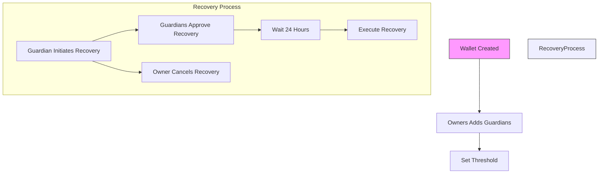

# Social Recovery Wallet

A secure Solana smart contract for wallet recovery using a social mechanism, allowing owners to designate guardians who can help recover access to their wallet if they lose their private keys.

## Architecture Overview

### Program Structure

The Social Recovery Wallet is built with Anchor, Solana's Rust-based smart contract framework. The program consists of:

- **Main Program File**: [`lib.rs`](programs/social_recovery_wallet/src/lib.rs) - Contains all instructions and account validation
- **State Management**: [`state/mod.rs`](programs/social_recovery_wallet/src/state/mod.rs) - Defines the Wallet account structure
- **Error Handling**: [`error.rs`](programs/social_recovery_wallet/src/error.rs) - Custom error types for clear error messaging
- **Instructions**: Modular implementation in [`instructions/`](programs/social_recovery_wallet/src/instructions/) directory

### Wallet Account Structure

The program uses a single main account type `Wallet` stored as a PDA (Program Derived Address) with the following fields:

```rust
#[account]
pub struct Wallet {
    pub owner: Pubkey,              // Current owner of the wallet
    pub guardians: Vec<Pubkey>,    // List of trusted guardians
    pub threshold: u8,             // Number of approvals needed for recovery
    pub recovery_in_progress: bool,// Flag indicating active recovery
    pub new_owner: Option<Pubkey>, // Proposed new owner during recovery
    pub recovery_initiated_at: Option<i64>, // Timestamp when recovery started
    pub approvals: Vec<Pubkey>,    // Guardians who have approved recovery
    pub bump: u8,                  // PDA bump seed
}
```

Key constants:
- Maximum guardians: 10
- Recovery period: 24 hours (86,400 seconds)

## Core Functionality

### Instructions

#### 1. Initialize Wallet
- **Description**: Creates a new social recovery wallet
- **Parameters**: 
  - `threshold`: Number of guardian approvals needed for recovery (1-10)
  - `bump`: PDA bump seed
- **Signer**: Wallet owner (payer)
- **Accounts**: Wallet PDA (initialized), System Program

#### 2. Add Guardian
- **Description**: Adds a new trusted guardian
- **Parameters**: Guardian's public key
- **Signer**: Wallet owner
- **Accounts**: Wallet PDA (writable)

#### 3. Remove Guardian
- **Description**: Removes an existing guardian
- **Parameters**: Guardian's public key
- **Signer**: Wallet owner
- **Accounts**: Wallet PDA (writable)

#### 4. Update Threshold
- **Description**: Changes the recovery approval threshold
- **Parameters**: New threshold value
- **Signer**: Wallet owner
- **Accounts**: Wallet PDA (writable)

#### 5. Initiate Recovery
- **Description**: Starts the wallet recovery process
- **Signer**: Any valid guardian
- **Accounts**: Wallet PDA (writable), New owner (read-only)
- **Requirements**: No active recovery, valid guardian

#### 6. Approve Recovery
- **Description**: Approves an active recovery request
- **Signer**: Any valid guardian
- **Accounts**: Wallet PDA (writable)
- **Requirements**: Guardian hasn't already approved

#### 7. Execute Recovery
- **Description**: Finalizes the recovery process
- **Signer**: Any valid guardian
- **Accounts**: Wallet PDA (writable)
- **Requirements**: Recovery period elapsed, threshold approvals met

#### 8. Cancel Recovery
- **Description**: Cancels an active recovery request
- **Signer**: Current wallet owner
- **Accounts**: Wallet PDA (writable)

## Recovery Process Flow



### Security Features

1. **24-hour Recovery Period**: Prevents immediate ownership transfer
2. **Threshold Approval**: Requires multiple guardians to approve recovery
3. **Guardian Validation**: Only registered guardians can participate
4. **Owner Control**: Current owner can cancel recovery at any time
5. **PDA Account Structure**: Secure program-controlled account

### Error Handling

The program implements comprehensive error handling with specific error codes:

- `InvalidOwner` (6000): Caller is not the wallet owner
- `InvalidSigner` (6001): Signer is not a valid guardian
- `InsufficientGuardians` (6002): Maximum guardians (10) reached
- `GuardianAlreadyExists` (6003): Guardian already registered
- `GuardianNotFound` (6004): Guardian not found in list
- `RecoveryPeriodNotElapsed` (6005): 24-hour recovery period not completed
- `RecoveryAlreadyInProgress` (6006): Another recovery already active
- `NoRecoveryInProgress` (6007): No active recovery to execute
- `InvalidThreshold` (6008): Threshold value invalid (0 or > number of guardians)
- `InvalidNewOwner` (6009): Proposed new owner address invalid
- `InvalidTransaction` (6010): Duplicate approval or invalid transaction

## Usage

### Getting Started

1. Deploy the program to Solana cluster
2. Initialize a new wallet with a recovery threshold
3. Add trusted guardians to the wallet
4. In case of lost keys, guardians initiate recovery process
5. Wait for recovery period and required approvals
6. Execute recovery to transfer ownership

### Testing

The program includes comprehensive integration tests using Anchor:

```typescript
// Example test flow
it("Initializes a new wallet with threshold", async () => {
  const tx = await program.methods
    .initialize(2, bump)
    .accounts({
      payer: owner.publicKey,
      wallet: walletPda,
      systemProgram: anchor.web3.SystemProgram.programId,
    })
    .signers([owner])
    .rpc();
  
  const walletAccount = await program.account.wallet.fetch(walletPda);
  assert.equal(walletAccount.threshold, 2);
});
```

## Program ID

The current program ID is: 
`H5ktc2VNhArukM8LDywCwy6d5NJaN7XY1oFa9adccmsz`

(Note: This will change when redeployed)

## Future Enhancements

1. **Recovery Account Separation**: Currently unused `Recovery` struct could be implemented for better state management
2. **Guardian Accounts**: `Guardian` struct for individual guardian management
3. **Recovery Time Customization**: Allow owners to set custom recovery periods
4. **Multisig Support**: Extend to support multisig wallets
5. **Notification System**: Implement off-chain notification for recovery events

## License

This program is provided under the Apache 2.0 license.
